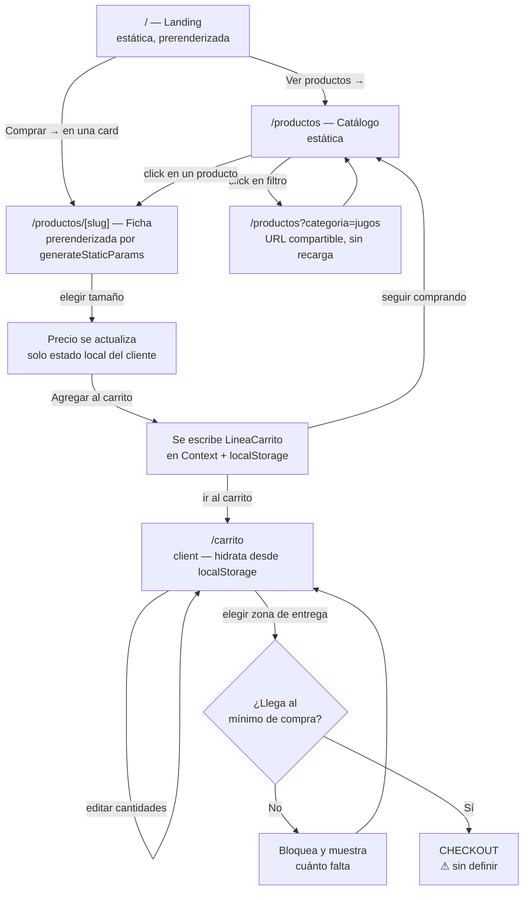

# 01 · El Arquitecto — Planificación

**Cuándo:** ahora, antes de escribir código.
**Estado:** ✅ Respondido

## Prompt

````
Actuá como un arquitecto de software senior diseñando sistemas escalables.

Necesito que diseñes la arquitectura técnica completa para el siguiente proyecto:

## Proyecto
Sitio público (e-commerce liviano) para una marca uruguaya de jugos orgánicos
prensados en frío. Landing + catálogo + ficha de producto + carrito. Más adelante
se suma una línea de geles energéticos para corredores/triatletas como segunda
línea de producto.

## Requisitos clave
- Usuarios esperados: tráfico bajo-medio, pedidos locales en Montevideo
- Tipo de aplicación: web, prioridad alta en SEO (la gente tiene que encontrarme
  buscando "jugos orgánicos Montevideo") y en preview al compartir links en
  WhatsApp/Instagram
- Restricciones técnicas: Next.js (App Router) + TypeScript + Tailwind, ya creado
  con create-next-app

## Modelo de negocio a soportar
- 3 jugos: Verde, Naranja y Rojo. Cada uno en 330ml y 910ml — el tamaño es una
  VARIANTE del mismo producto, no un producto separado. Un solo catálogo.
- Shots: categoría aparte, formato único (por ahora Shot de Cúrcuma y Jengibre)
- A futuro: geles, como tercera categoría, sin rehacer el modelo

## Lo que necesito que entregues
1. Estructura de carpetas del proyecto: árbol de archivos inicial (organización de
   app/, componentes, tipos, utilidades)
2. Modelo de datos: entidades, campos clave y relaciones. Que soporte jugos con
   variante de tamaño, shots sin variante, y quede abierto para geles
3. Tipado TypeScript del dominio (Producto, Variante, Categoría)
4. Diagrama de flujo del recorrido principal del usuario (landing → catálogo →
   ficha → carrito → checkout), paso a paso
5. Decisiones de diseño: las 3-5 decisiones arquitectónicas más importantes y por qué
   (qué se renderiza en servidor vs cliente, dónde vive el estado del carrito, etc.)
6. Riesgos técnicos: 2-3 problemas posibles y cómo mitigarlos

Revisá lo que ya existe en el proyecto antes de proponer cambios.
````

---

## Respuesta

### 0. Lo que ya existe (revisado antes de proponer)

| | |
|---|---|
| Next.js | **16.3.0**, Turbopack por defecto |
| React | 19.2.8 |
| Tailwind | **v4** — CSS-first, sin `tailwind.config.js`; la config vive en `@theme` dentro de `globals.css` |
| TypeScript | strict, alias `@/*` → raíz, sin `src/` |
| `app/` | Solo el boilerplate de create-next-app: `layout.tsx`, `page.tsx`, `globals.css`, `favicon.ico` |
| Extra | `wireframe-landing-jugos.html` en la raíz: wireframe de la landing con las 5 secciones + footer |

Tres cosas de **Next 16** que cambian respecto de versiones anteriores y
condicionan el diseño (verificadas en `node_modules/next/dist/docs/`):

- `params` y `searchParams` son **Promises** → `const { slug } = await props.params`
- `PageProps<'/productos/[slug]'>` y `LayoutProps<'/'>` son helpers **globales**, sin import
- `cacheComponents` (el modelo `use cache`) es **opt-in**. Con el catálogo en
  archivos locales no hace falta: todo prerenderiza estático sin configurar nada

El wireframe fija el orden de la landing: Hero → Intro de marca (3 pilares +
párrafo) → Productos (título + "Ver todos" + carrusel) → Beneficios (grid de 4)
→ Sobre nosotros (foto + copy) → Footer (newsletter + 3 columnas).

---

### 1. Estructura de carpetas

```
app/
  layout.tsx                    # fonts, metadata base, Header/Footer, CartProvider
  page.tsx                      # landing — compone las 5 secciones
  globals.css                   # @theme de Tailwind v4: paleta + tokens
  sitemap.ts                    # se alimenta del catálogo
  robots.ts
  opengraph-image.tsx           # preview para WhatsApp/Instagram
  productos/
    page.tsx                    # catálogo, filtro por ?categoria=
    [slug]/
      page.tsx                  # generateStaticParams + generateMetadata
      opengraph-image.tsx       # preview por producto
  carrito/
    page.tsx

components/
  ui/          Button, Container, Section, Price, QuantityStepper
  layout/      Header, Footer, Newsletter, CartIndicator
  home/        Hero, Pilares, ProductosSection, Beneficios, SobreNosotros
  producto/    ProductCard, ProductGrid, CategoryFilter, SizeSelector,
               AddToCartButton, ProductGallery
  carrito/     CartLineItem, CartSummary, DeliveryZonePicker

lib/
  catalogo/
    productos.ts               # los datos
    categorias.ts
    queries.ts                 # ÚNICA puerta de entrada a los datos
  carrito/
    context.tsx                # 'use client' — estado + localStorage
    calculos.ts                # subtotal, envío, mínimos (puro, testeable)
  format.ts                    # formatPrecio, formatVolumen
  seo.ts                       # metadata helpers + JSON-LD Product

types/
  producto.ts
  carrito.ts

public/
  productos/                   # fotos de producto
```

**Por qué así:**

- **Sin `src/`.** No aporta con este tamaño y el proyecto ya está plano.
- **Componentes por dominio, no por tipo.** `home/` muere el día que rediseñes la
  landing; `producto/` sobrevive. Mezclados en un `components/` plano no sabés
  qué se puede borrar sin romper nada.
- **`lib/catalogo/queries.ts` como única puerta a los datos.** Ningún componente
  importa `productos.ts` directo. El día que el catálogo se mude a un CMS o a una
  base, cambia un archivo y nada más.
- **`lib/carrito/calculos.ts` separado del context.** Las funciones puras
  (subtotal, envío, mínimo de compra) se testean sin montar React. Es lo único
  del proyecto que realmente vale la pena testear — ver [06](06-escudo.md).

---

### 2. Modelo de datos

**Entidades y relaciones:**

```
Categoria (jugos | shots | geles)
    │
    │ 1..N
    ▼
Producto ──── slug (id canónico, también el segmento de URL)
    │
    ├── 1..N ── Variante      (330ml / 910ml / única)  ← unidad de compra
    ├── 0..N ── Ingrediente   (solo jugos y shots)
    └── 1..N ── ImagenProducto

LineaCarrito ── (productoSlug + varianteId) ──▶ apunta a Variante, no la copia
    │
    ▼
ZonaEntrega ── costoEnvio, minimoCompra, diasEntrega
```

**Las tres decisiones de modelado que importan:**

1. **La variante es la unidad de compra, no el producto.** 330ml y 910ml son dos
   variantes del mismo producto. Un shot es un producto con **una sola**
   variante. Mismo tipo, misma card, misma ruta, mismo carrito — el
   `SizeSelector` se oculta solo cuando `variantes.length === 1`. No hay ninguna
   rama especial para shots en ningún lado.

2. **Categoría como unión discriminada, no como campo opcional.** Si
   `ingredientes` fuera `ingredientes?:`, cada componente tendría que chequear
   `undefined` y los geles arrastrarían campos que no les aplican para siempre.
   Con la unión, agregar geles es agregar una interfaz y TypeScript te marca cada
   `switch` incompleto. Esa es la garantía real de "no rehacer el modelo".

3. **El carrito guarda identificadores, nunca objetos.** Persistís
   `{ productoSlug, varianteId, cantidad }`. Precio y nombre se releen del
   catálogo al hidratar. Si guardaras el producto entero, alguien que agregó algo
   hace tres meses vuelve y el carrito le muestra —y le cobra— el precio viejo.

---

### 3. Tipado TypeScript

> Los puntos marcados **`[decisión]`** son criterio mío: revisalos y cambialos si
> no coinciden con cómo lo pensás vos.

```ts
// types/producto.ts

/** Agregar "geles" acá propaga el tipo a todo el proyecto. */
export const CATEGORIAS = ["jugos", "shots", "geles"] as const;
export type CategoriaId = (typeof CATEGORIAS)[number];

export interface Categoria {
  id: CategoriaId;
  nombre: string;
  descripcion: string;
  orden: number;
  /** [decisión] false = no aparece en el filtro ni en el sitemap.
   *  Permite dejar "geles" cargado y prenderlo el día del lanzamiento. */
  activa: boolean;
}

/** [decisión] Precio en CENTÉSIMOS de peso uruguayo: 29000 = $290.
 *  Entero, para no hacer aritmética de plata con floats. */
export type PrecioUYU = number;

/** Presentación comprable. Lo que va al carrito es siempre una variante. */
export interface Variante {
  id: string;          // "330ml" | "910ml" | "unico"
  nombre: string;      // etiqueta del selector: "330 ml"
  volumenMl: number;
  precio: PrecioUYU;
  sku: string;
  disponible: boolean;
}

export interface Ingrediente {
  nombre: string;
  organico: boolean;
  /** [decisión] Propuesta, no obligatorio. Sirve para que el claim de
   *  "productores uruguayos" salga del dato y no de un texto suelto.
   *  Si no lo vas a usar, sacalo. */
  origen?: "uruguay" | "importado";
}

export interface ImagenProducto {
  src: string;
  alt: string;
  width: number;
  height: number;
}

/** Campos comunes a toda línea de producto, presente y futura. */
interface ProductoBase {
  slug: string;            // id canónico y segmento de URL
  nombre: string;
  tagline: string;         // una línea, para la card del carrusel
  descripcion: string;     // párrafo de la ficha
  /** [decisión] Token CSS, no un hex suelto: la card lo usa para pintar
   *  el fondo de la foto con el color real del jugo. */
  colorToken: string;
  imagenes: ImagenProducto[];
  /** Tupla no vacía: el compilador impide un producto sin nada comprable. */
  variantes: readonly [Variante, ...Variante[]];
  varianteDefaultId: Variante["id"];
  destacado: boolean;      // aparece en el carrusel de la landing
  seo?: { titulo?: string; descripcion?: string };
}

export interface Jugo extends ProductoBase {
  categoria: "jugos";
  ingredientes: Ingrediente[];
  beneficios: string[];
}

export interface Shot extends ProductoBase {
  categoria: "shots";
  ingredientes: Ingrediente[];
  dosisSugerida: string;
}

/** Placeholder tipado: ruta, catálogo y carrito ya lo soportan.
 *  Los campos son una apuesta — ajustalos cuando definas la línea. */
export interface Gel extends ProductoBase {
  categoria: "geles";
  carbohidratosG: number;
  cafeinaMg: number;
  sodioMg: number;
  sabor: string;
}

export type Producto = Jugo | Shot | Gel;

// Type guards: en la ficha escribís if (esShot(p)) y adentro TypeScript
// ya sabe que p.dosisSugerida existe. Sin castear.
export const esJugo = (p: Producto): p is Jugo => p.categoria === "jugos";
export const esShot = (p: Producto): p is Shot => p.categoria === "shots";
export const esGel = (p: Producto): p is Gel => p.categoria === "geles";

/** Todo lo que se comunica por ingredientes, sin importar la línea. */
export type ProductoConIngredientes = Jugo | Shot;
export const tieneIngredientes = (p: Producto): p is ProductoConIngredientes =>
  esJugo(p) || esShot(p);

export function varianteDefault(p: Producto): Variante {
  return p.variantes.find((v) => v.id === p.varianteDefaultId) ?? p.variantes[0];
}

export function precioDesde(p: Producto): PrecioUYU {
  return Math.min(...p.variantes.map((v) => v.precio));
}
```

```ts
// types/carrito.ts
import type { PrecioUYU, Producto, Variante } from "./producto";

/** Lo que se persiste en localStorage: IDs, nunca objetos. */
export interface LineaCarrito {
  productoSlug: Producto["slug"];
  varianteId: Variante["id"];
  cantidad: number;
}

/** Lo que consume la UI: la línea ya cruzada contra el catálogo. */
export interface LineaResuelta extends LineaCarrito {
  producto: Producto;
  variante: Variante;
  subtotal: PrecioUYU;
}

export interface ZonaEntrega {
  id: string;
  nombre: string;
  costoEnvio: PrecioUYU;
  minimoCompra: PrecioUYU;
  diasEntrega: string[];
}

export interface EstadoCarrito {
  lineas: LineaCarrito[];
  zonaId: ZonaEntrega["id"] | null;
}

export interface TotalesCarrito {
  subtotal: PrecioUYU;
  envio: PrecioUYU;
  total: PrecioUYU;
  /** Para mostrar "te faltan $X para llegar al mínimo". 0 si ya se alcanzó. */
  faltaParaMinimo: PrecioUYU;
  cantidadItems: number;
}
```

---

### 4. Flujo del usuario



**Paso a paso:**

1. **Landing.** Todo prerenderizado. El carrusel de Productos tira a la ficha
   directo — el atajo de compra más corto del sitio.
2. **Catálogo.** El filtro de categoría vive en `?categoria=`, no en estado de
   React. La URL queda compartible y cada vista es indexable.
3. **Ficha.** Prerenderizada con `generateStaticParams`, metadata por producto
   con `generateMetadata`. El selector de tamaño es lo **único** interactivo:
   cambia la variante seleccionada y con eso el precio. Nada más se hidrata.
4. **Agregar al carrito.** Escribe `{ productoSlug, varianteId, cantidad }` en el
   Context, que persiste en localStorage.
5. **Carrito.** Lee del storage, resuelve cada línea contra el catálogo, calcula
   totales. La zona de entrega define costo de envío y mínimo de compra.
6. **Checkout.** ⚠️ **Sin definir — es la decisión más grande que falta.** Tres
   caminos, y la arquitectura aguanta cualquiera:
   - **WhatsApp con el pedido prearmado** — cero backend, cobrás en la entrega.
     Lo más rápido para arrancar en Montevideo.
   - **Formulario → email/DB** — te queda registro del pedido, sigue sin pasarela.
   - **Pasarela (Mercado Pago)** — cobrás online. Suma backend, webhooks y manejo
     de estados de pago.

   No lo decidí por vos. Hasta que lo definas, `/carrito` cierra en un CTA.

---

### 5. Decisiones arquitectónicas

**1 · Catálogo en archivos TypeScript, no en CMS ni base de datos.**
Son 4 productos que cambian pocas veces al año. Una base agrega hosting, latencia
y un punto de falla para resolver un problema que no tenés. En archivos, el
catálogo es tipado —el compilador te avisa si falta un campo— y todo el sitio
prerenderiza estático. `queries.ts` como única puerta deja la migración abierta:
son funciones `async` desde el día uno aunque hoy resuelvan en memoria, así el
día que muevas los datos ningún componente cambia.

**2 · Server Components por defecto; `"use client"` en 4 lugares y nada más.**
Solo son cliente: `SizeSelector`, `AddToCartButton`, `CartIndicator` y todo
`carrito/`. Landing, catálogo y fichas van 100% en servidor. Esto es *el*
requisito de SEO: el HTML llega con el contenido adentro, no vacío esperando JS.

**3 · El carrito vive solo en el cliente (Context + localStorage).**
Sin sesión, sin cookies, sin base. Para pedidos locales con checkout por WhatsApp
no hace falta más. Consecuencia asumida: el carrito no cruza dispositivos. Es el
trade-off correcto — la alternativa es autenticación, y eso es un proyecto aparte.

**4 · Una sola ruta `/productos/[slug]` para todas las categorías.**
No `/jugos/[slug]` + `/shots/[slug]`. Un catálogo, una ficha, y el tipo
discriminado decide qué bloques se muestran. Cuando entren los geles, la ruta ya
funciona: solo hay que sumar el caso al render.

**5 · El filtro de categoría en la URL, no en estado de React.**
`/productos?categoria=jugos` es compartible, indexable y sobrevive al refresh.
Con `useState` perdés las tres cosas.

---

### 6. Riesgos técnicos

**Riesgo 1 — Precios compilados en el bundle estático.**
Con el catálogo en archivos, cambiar un precio exige commit + deploy. Con 4
productos es tolerable; con 20 y promos semanales, no.
*Mitigación:* `queries.ts` ya aísla el acceso. Cuando la frecuencia de cambio
duela, movés los datos a una fuente externa y agregás `revalidate` o `use cache`
con `cacheLife` — sin tocar un solo componente. **Señal para migrar:** cuando
edites precios más de una vez por mes.

**Riesgo 2 — Mismatch de hidratación en el carrito.**
El servidor no conoce localStorage, así que el HTML sale con el carrito vacío y
el cliente lo llena al montar. Si `CartIndicator` renderiza el número de items en
el primer render, React tira error de hidratación.
*Mitigación:* el badge se monta con `useEffect` y no muestra nada hasta que
hidrató. Es el bug clásico de este stack — está pre-diagnosticado en
[03](03-detective.md).

**Riesgo 3 — El carrito no valida disponibilidad.**
`disponible: false` en una variante se lee en la ficha, pero un carrito guardado
en localStorage hace semanas puede tener algo que ya no vendés o que cambió de
precio.
*Mitigación:* como el carrito guarda IDs y no objetos, al hidratar se resuelve
contra el catálogo actual. Ahí filtrás lo no disponible y avisás qué se sacó. Es
justamente la razón de la decisión de modelado #3.

---

### Lo que falta para poder escribir el catálogo real

1. **Precios** de cada jugo en 330ml y 910ml, y del shot
2. **Zonas de entrega**: nombre, costo de envío, mínimo de compra, días de reparto
3. **Fotos** de producto, o confirmación de arrancar con placeholders
4. **Checkout**: cuál de los tres caminos
